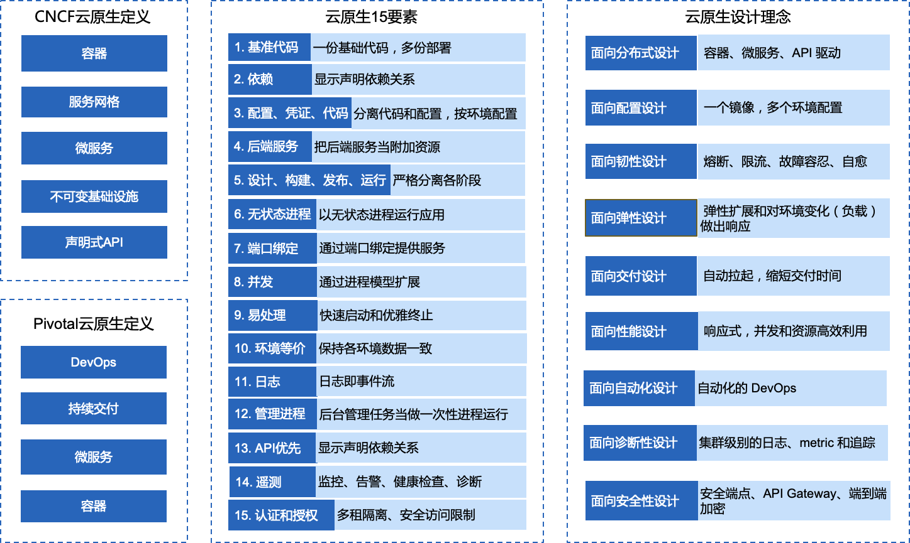
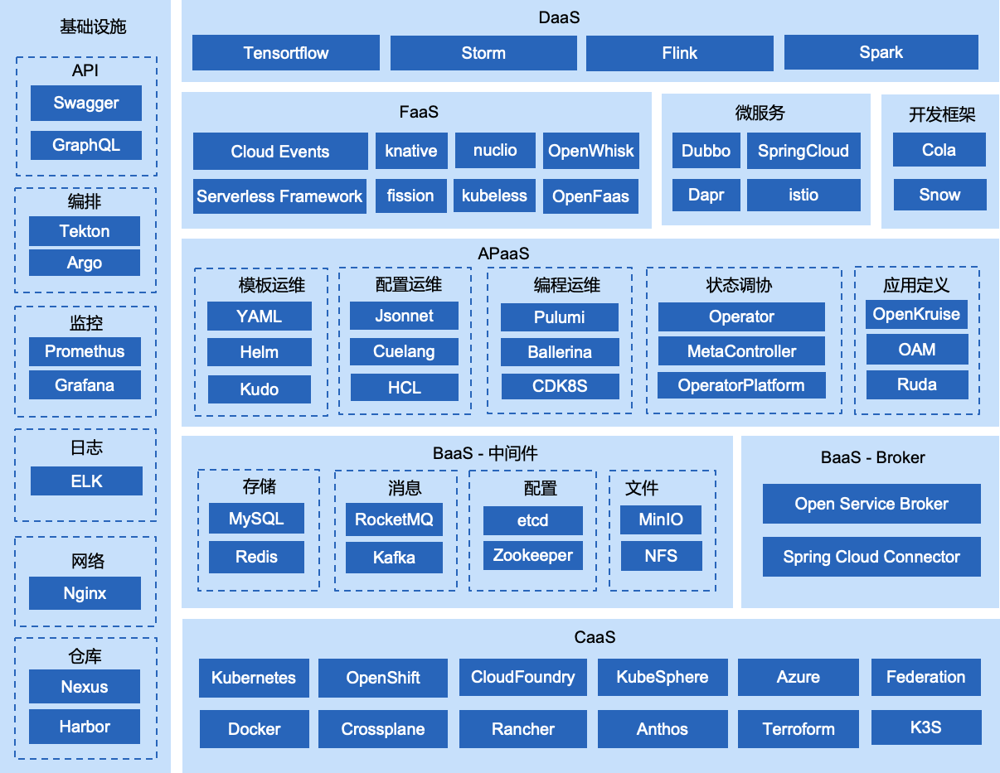
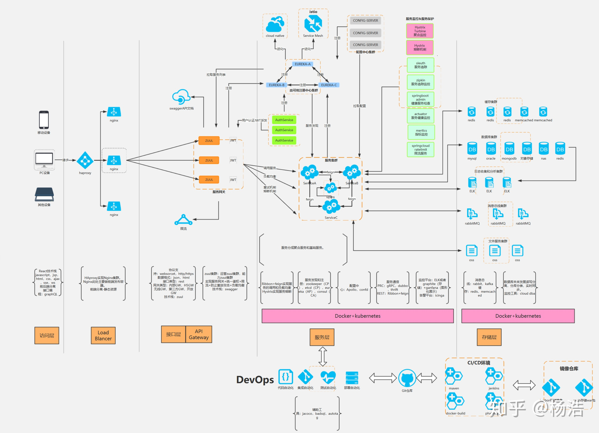
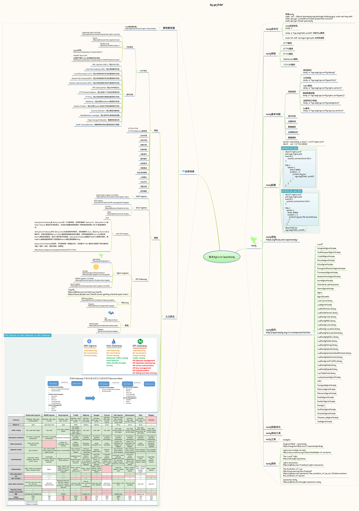

---

# Cloud Native

​		云原生既包含技术（微服务，敏捷基础设施），也包含管理（DevOps，持续交付，康威定律，重组等）。云原生也可以说是一系列云技术、企业管理方法的集合。

## 一. Microservice微服务

### 1. 常用框架

#### Spring Cloud框架
> 
> 

#### Dubbo框架

> 
> 摘自: https://dubbo.apache.org/zh/docs/v2.7/dev/design/
> 

### 微服务2.0时代 - ServiceMesh

​		服务网格作为云原生网络基础设施，负责服务间通信的一切方面。

### 2. 基础服务
#### API网关服务

> 

#### 消息中间件-Kafka

> 
> 摘自: https://gitee.com/yejinlei/about-bigdata

## 二. 容器及Kubernetes

​		容器是云原生应用的最小的构建单元，一次构建，到处运行;

​		Kubernetes是云原生操作系统，声明式 API 是它的核心，Operator 操控万物。

## 三. CI/CD持续交付

## 四. DevOps开发与运维

## 五. 参考资料
1. [迁移到云原生应用架构](https://jimmysong.io/migrating-to-cloud-native-application-architectures/)